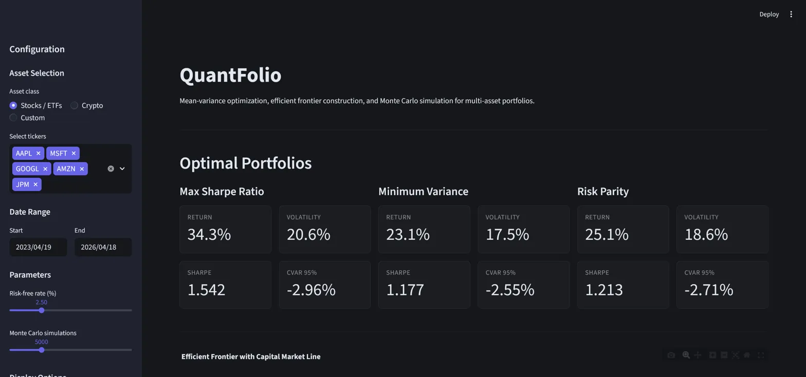
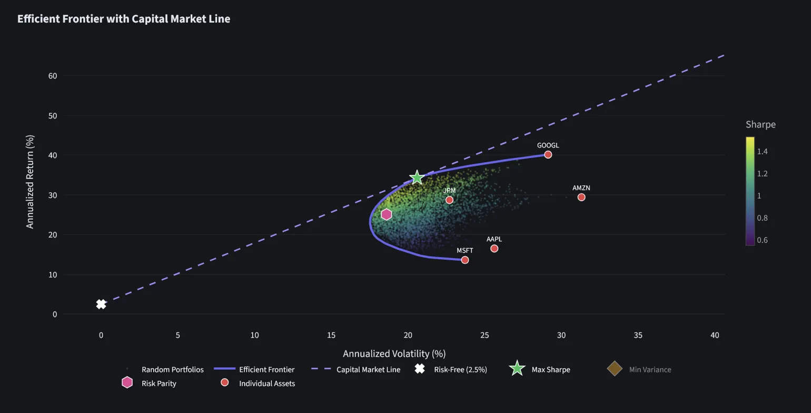
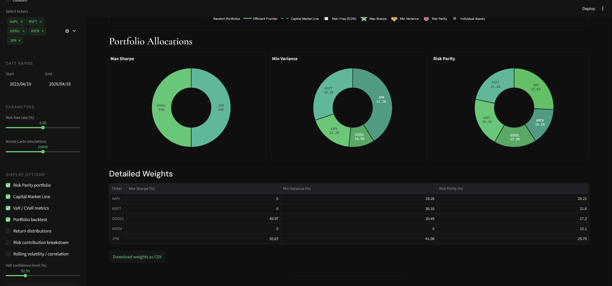
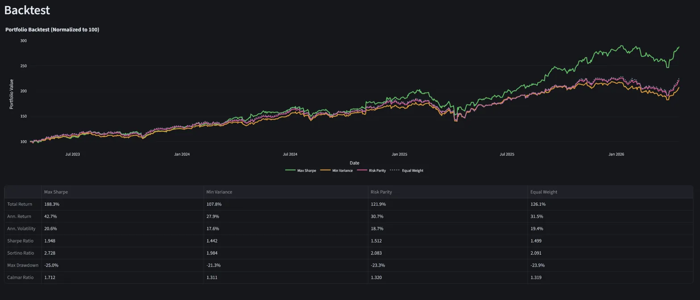

# QuantFolio

Quantitative portfolio optimization engine built with Python and Streamlit. Implements mean-variance optimization (Markowitz, 1952) with interactive controls for efficient frontier construction, risk parity allocation, Monte Carlo simulation, backtesting, and risk analysis across stocks, ETFs, and cryptocurrencies.

**[Live Demo →](https://quantfolio-mx.streamlit.app)**

---

## Screenshots

---

## Features

- **Efficient Frontier + Capital Market Line** — traces optimal risk-return tradeoff via constrained optimization (SLSQP)
- **Three Optimization Strategies** — Maximum Sharpe Ratio, Global Minimum Variance, and Risk Parity portfolios
- **Monte Carlo Simulation** — up to 50,000 random portfolio allocations to visualize the feasible region
- **Portfolio Backtesting** — equity curves comparing all strategies vs equal-weight, with Sharpe, Sortino, Calmar ratios
- **VaR / CVaR** — Value at Risk and Conditional VaR at configurable confidence levels
- **Return Distribution** — histograms with fitted normal overlay to reveal fat tails
- **Risk Contribution Breakdown** — decomposition of portfolio risk by asset
- **Rolling Analysis** — rolling volatility and pairwise correlation over configurable windows
- **Correlation Heatmap** — return correlations to assess diversification potential
- **Drawdown Analysis** — peak-to-trough decline visualization per asset
- **Asset Stats** — annualized return, volatility, Sharpe ratio, max drawdown, skewness, kurtosis
- **Modular Display** — toggle features on/off via sidebar checkboxes
- **CSV Export** — download optimal weights
- **Real Data** — historical prices from Yahoo Finance via `yfinance`

## Tech Stack

| Layer | Technology |
|-------|-----------|
| Frontend | Streamlit |
| Visualization | Plotly |
| Optimization | SciPy (SLSQP) |
| Data | yfinance, Pandas, NumPy |
| Deployment | Streamlit Cloud |

## How It Works

### Mean-Variance Optimization

Given *n* assets with expected return vector **μ** and covariance matrix **Σ**, the portfolio return and variance are:
R_p = w^T · μ
σ²_p = w^T · Σ · w
