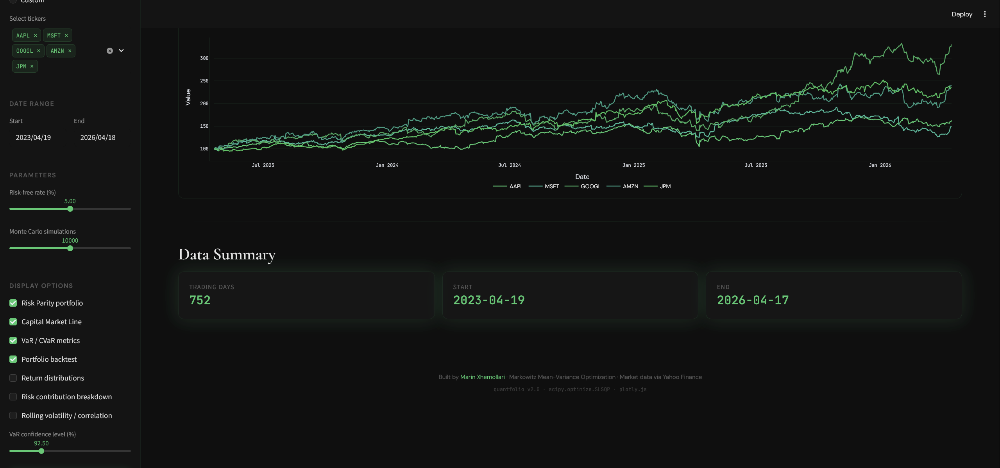

# QuantFolio

Quantitative portfolio optimization engine built with Python and Streamlit. Implements mean-variance optimization (Markowitz, 1952) with interactive controls for efficient frontier construction, risk parity allocation, Monte Carlo simulation, backtesting, and risk analysis across stocks, ETFs, and cryptocurrencies.

**[Live Demo →](https://quantfolio-marinx.streamlit.app)**

---

## Screenshots




---

## Features

- **Efficient Frontier + Capital Market Line** — traces optimal risk-return tradeoff via constrained optimization (SLSQP)
- **Three Optimization Strategies** — Maximum Sharpe Ratio, Global Minimum Variance, and Risk Parity portfolios
- **Monte Carlo Simulation** — up to 50,000 random portfolio allocations to visualize the feasible region
- **Portfolio Backtesting** — equity curves comparing all strategies vs equal-weight, with Sharpe, Sortino, Calmar ratios
- **VaR / CVaR** — Value at Risk and Conditional VaR at configurable confidence levels
- **Return Distribution** — histograms with fitted normal overlay to reveal fat tails
- **Risk Contribution Breakdown** — decomposition of portfolio risk by asset
- **Rolling Analysis** — rolling volatility and pairwise correlation over configurable windows
- **Correlation Heatmap** — return correlations to assess diversification potential
- **Drawdown Analysis** — peak-to-trough decline visualization per asset
- **Asset Stats** — annualized return, volatility, Sharpe ratio, max drawdown, skewness, kurtosis
- **Modular Display** — toggle features on/off via sidebar checkboxes
- **CSV Export** — download optimal weights
- **Real Data** — historical prices from Yahoo Finance via `yfinance`

## Tech Stack

| Layer | Technology |
|-------|-----------|
| Frontend | Streamlit |
| Visualization | Plotly |
| Optimization | SciPy (SLSQP) |
| Data | yfinance, Pandas, NumPy |
| Deployment | Streamlit Cloud |

## How It Works

### Return Definitions

Daily simple returns are used throughout for mathematical consistency with portfolio aggregation:

```
R_i,t = (P_i,t / P_i,t-1) − 1
```

This ensures that the portfolio return is exactly the weighted sum of asset returns, `R_p = w · R`, which is not true for log returns. Annualized statistics are computed assuming 252 trading days per year.

### Mean-Variance Optimization

Given *n* assets with expected return vector **μ** and covariance matrix **Σ**, the portfolio return and variance are:

```
R_p = wᵀ · μ
σ²_p = wᵀ · Σ · w
```

Subject to:
- Sum of weights = 1 (fully invested)
- 0 ≤ w_i ≤ 1 (long-only, no leverage)

Solved numerically with Sequential Least Squares Programming (`scipy.optimize.minimize`, method=`SLSQP`).

### Three Portfolio Strategies

**Maximum Sharpe Ratio** — maximizes the risk-adjusted excess return:

```
maximize  (wᵀμ − r_f) / √(wᵀΣw)
```

**Global Minimum Variance** — minimizes total portfolio variance:

```
minimize  wᵀΣw
```

**Risk Parity** — equalizes each asset's contribution to total portfolio risk:

```
minimize  Σ (RC_i − σ_p/n)²

where  RC_i = w_i · (Σw)_i / √(wᵀΣw)
```

### Efficient Frontier

The frontier is traced by minimizing variance for a range of target returns, producing the set of Pareto-optimal portfolios.

### Capital Market Line

The line from the risk-free rate through the tangency portfolio (Max Sharpe):

```
E[R_p] = r_f + [(E[R_T] − r_f) / σ_T] · σ_p
```

### Value at Risk (VaR) & Conditional VaR (CVaR)

At confidence level α (e.g., 95%):

```
VaR_α = percentile of portfolio returns at (1 − α) × 100%
CVaR_α = E[R_p | R_p ≤ VaR_α]
```

CVaR (also called Expected Shortfall) captures the average loss beyond the VaR threshold — more sensitive to tail risk than VaR alone.

### Backtest Statistics

| Metric | Formula |
|--------|---------|
| Annualized Return | (final / initial)^(252/N) − 1 |
| Annualized Volatility | σ_daily · √252 |
| Sharpe Ratio | (R_ann − r_f) / σ_ann |
| Sortino Ratio | (R_ann − r_f) / σ_downside,ann |
| Max Drawdown | min((P_t − max(P_{≤t})) / max(P_{≤t})) |
| Calmar Ratio | R_ann / \|MDD\| |

## Assumptions & Limitations

- Long-only portfolios (no short selling)
- Historical returns and covariances used as forward-looking estimates (common assumption, subject to estimation error)
- No transaction costs or taxes modeled in backtest
- Mean-variance framework assumes returns are either normally distributed or investors have quadratic utility — real returns exhibit skewness and fat tails (the Asset Stats tab surfaces this)
- Weights are optimized once on in-sample data (no walk-forward or rolling re-optimization)

## Running Locally

```bash
git clone https://github.com/Marin-X/QuantFolio.git
cd QuantFolio
pip install -r requirements.txt
streamlit run app.py
```

## References

- Markowitz, H. (1952). "Portfolio Selection." *The Journal of Finance*, 7(1), 77–91.
- Sharpe, W. F. (1966). "Mutual Fund Performance." *The Journal of Business*, 39(1), 119–138.
- Maillard, S., Roncalli, T., and Teïletche, J. (2010). "The Properties of Equally Weighted Risk Contribution Portfolios." *Journal of Portfolio Management*, 36(4), 60–70.
- Rockafellar, R. T. and Uryasev, S. (2000). "Optimization of Conditional Value-at-Risk." *Journal of Risk*, 2, 21–42.

---

Built by [Marin Xhemollari](https://marinxhemollari.com) · [Portfolio](https://marinxhemollari.com) · [LinkedIn](https://linkedin.com/in/marinxhemollari)
